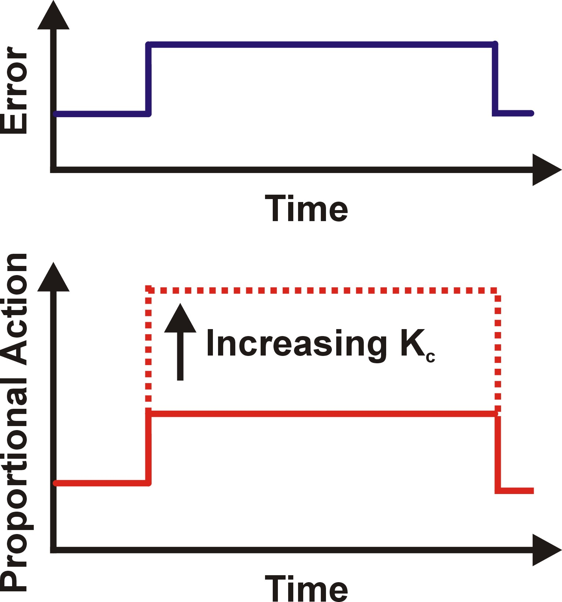
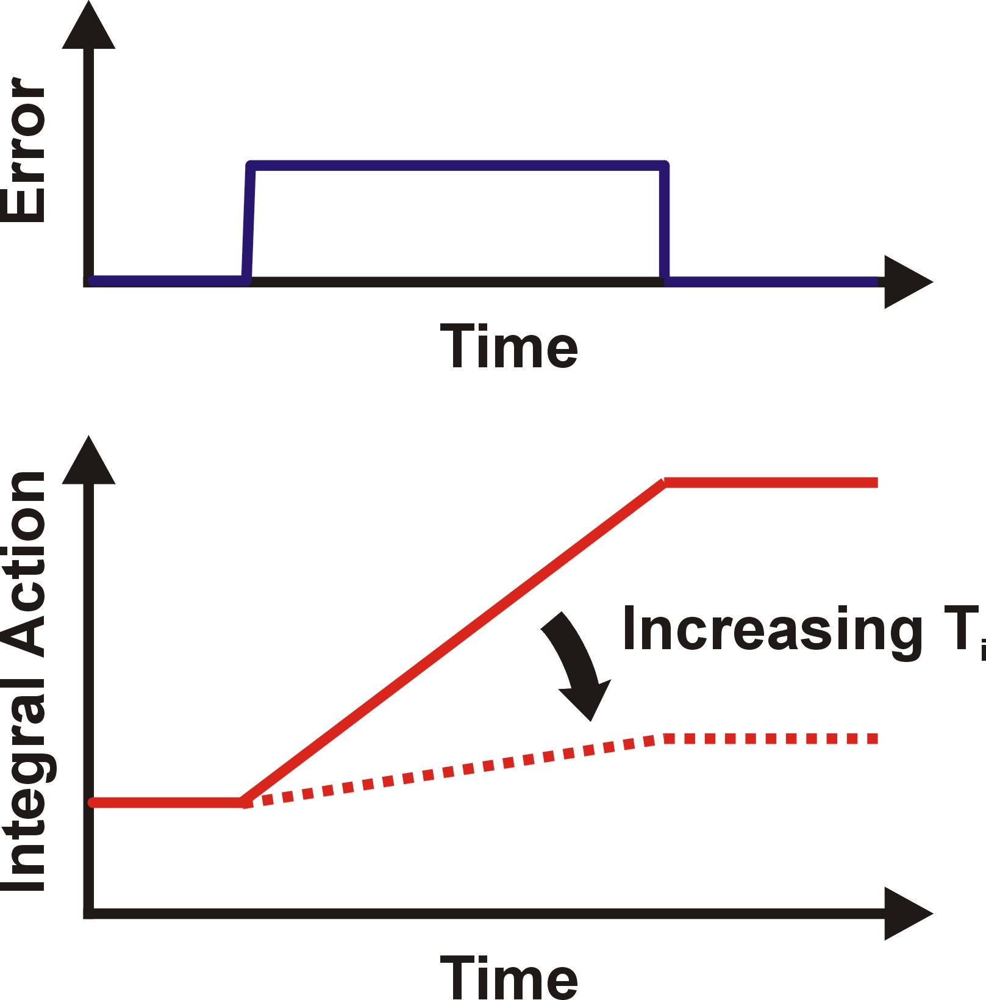
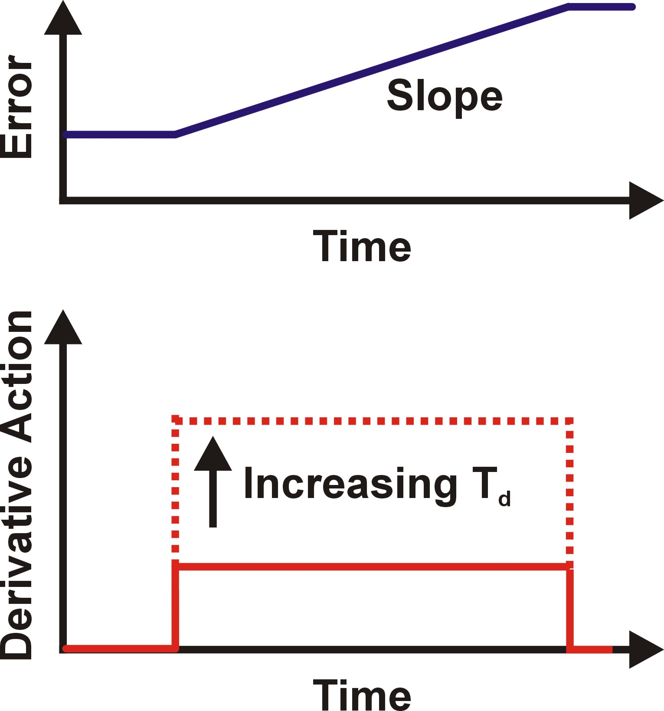

# Vehicle Steering Using PID Control
In this project, we implement a PID controller to steer the self driving car around the track in Udacity's [Simulator](https://github.com/udacity/CarND-PID-Control-Project/releases).
The project was created based on the Udacity [Starter Code](https://github.com/udacity/CarND-PID-Control-Project).

---
## About PID controller:
PID controllers are named after the Proportional, Integral and Derivative control modes they have. IT's basically a  control loop feedback mechanism.
As the name suggests, PID algorithm consists of three basic coefficients: proportional, integral and derivative which are varied to get optimal response.

### Proportional (P):
The proportional control mode is in most cases the main driving force in a controller. It changes the controller output in proportion to the error. If the error gets bigger, the control action gets bigger. This makes a lot of sense, since more control action is needed to correct large errors.
The adjustable setting for proportional control is called the Controller Gain (Kp). A higher controller gain will increase the amount of proportional control action for a given error.
If the controller gain is set too high the control loop will begin oscillating and become unstable. If the controller gain is set too low, it will not respond adequately to disturbances or set point changes.

<figure>
 
</figure>

### Integral (I):
As long as there is an error present, the integral control mode takes into account the integral of error over past time, it will continuously increment or decrement the controller’s output to reduce the error.
Given enough time, integral action will drive the controller output far enough to reduce the error to zero.
If the error is large, the integral mode will increment/decrement the controller output fast, if the error is small, the changes will be slower.

<figure>
 
</figure>

### Differential (D):
The third control mode in a PID controller is derivative. Using the derivative control mode of a controller can make a control loop respond a little faster than with PI control alone.
The derivative control mode produces an output based on the rate of change of the error. The derivative mode produces more control action if the error changes at a faster rate.
If there is no change in the error, the derivative action is zero.

<figure>
 
</figure>

### PID:
PID controller output is made up of the sum of the proportional, integral, and derivative control actions.
PID control provides more control action sooner than what is possible with P or PI control. This reduces the effect of a disturbance, and shortens the time it takes for the level to return to its set point.

<figure>
 
</figure>

---
## Hyperparameters Tunning:
Hyperparameters were further tuned manually by try-and-error process.

---
## Dependencies

* cmake >= 3.5
 * All OSes: [click here for installation instructions](https://cmake.org/install/)
* make >= 4.1(mac, linux), 3.81(Windows)
  * Linux: make is installed by default on most Linux distros
  * Mac: [install Xcode command line tools to get make](https://developer.apple.com/xcode/features/)
  * Windows: [Click here for installation instructions](http://gnuwin32.sourceforge.net/packages/make.htm)
* gcc/g++ >= 5.4
  * Linux: gcc / g++ is installed by default on most Linux distros
  * Mac: same deal as make - [install Xcode command line tools]((https://developer.apple.com/xcode/features/)
  * Windows: recommend using [MinGW](http://www.mingw.org/)
* [uWebSockets](https://github.com/uWebSockets/uWebSockets)
  * Run either `./install-mac.sh` or `./install-ubuntu.sh`.
  * If you install from source, checkout to commit `e94b6e1`, i.e.
    ```
    git clone https://github.com/uWebSockets/uWebSockets 
    cd uWebSockets
    git checkout e94b6e1
    ```
    Some function signatures have changed in v0.14.x. See [this PR](https://github.com/udacity/CarND-MPC-Project/pull/3) for more details.
* Simulator. You can download these from the [project intro page](https://github.com/udacity/self-driving-car-sim/releases) in the classroom.

There's an experimental patch for windows in this [PR](https://github.com/udacity/CarND-PID-Control-Project/pull/3)

## Basic Build Instructions

1. Clone this repo.
2. Run `build.sh`
3. Open the simulator and select PID control project.
4. Run `run.sh` 
